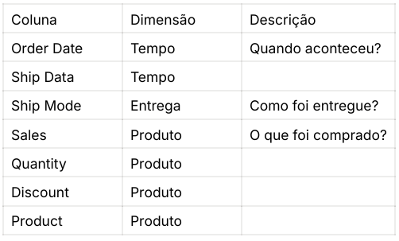

# Análise Exploratória de Dados - SuperStore

## 🧠 Passo 1: Conhecendo o Problema de Negócio

A SuperStore é uma rede de supermercados com várias unidades físicas. A empresa busca melhorar suas decisões com base em dados, principalmente no que se refere ao abastecimento de produtos e comportamento de vendas.

O time de dados foi criado para integrar e analisar dados transacionais, com o objetivo de:
- Compreender o comportamento dos clientes
- Identificar os produtos mais comprados
- Analisar o valor médio gasto por compra
- Detectar padrões de devoluções
- Avaliar o número de pedidos ao longo do tempo

Você foi um dos primeiros contratados para esse time e recebeu o desafio de analisar os pedidos e fornecer insights para a área de negócios.

---

## 📊 Passo 2: Análise Descritiva

---

## ❓ Passo 3: Perguntas de Negócio

- Quantidade de pedidos por data (dia, mês, ano, semana, feriado)
- Quantidade de pedidos por quantidade de itens
- Quantidade de pedidos por produto
- Quantidade de pedidos por cliente

---

## 📁 Dados Utilizados

- `orders.csv`

---

## 🛠️ Objetivo

Realizar uma análise exploratória dos dados da SuperStore e responder às perguntas de negócio com base nas informações contidas no dataset.
